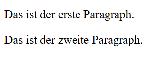

# H1 HTML-Basis
## Übung 1
### Erste Website (ohne Leerzeilen)

```html
<!DOCTYPE html>
<html lang="de">
<head>
  <meta charset="UTF-8">
  <title>Leerzeilen-Test</title>
</head>
<body>

  <p>Das ist der erste Paragraph.</p>
  <p>Das ist der zweite Paragraph.</p>

</body>
</html>
```

Sie zeigt das an:  


### Zweite Website (mit Leerzeilen)

```html 
<!DOCTYPE html>
<html lang="de">
<head>
  <meta charset="UTF-8">
  <title>Leerzeilen-Test</title>
</head>
<body>

  <p>Das ist der erste Paragraph.</p>


  <p>Das ist der zweite Paragraph.</p>

</body>
</html>
```
Sie zeigt das an:  


### Was ist passiert?
Obwohl ich viele Zeilenumbrüche und Leerschläge eingefügt habe, zeigt der Browser sie nicht an. Die beiden Paragraphen stehen direkt untereinander, mit dem normalen Abstand.

### Warum?
HTML behandelt mehrere Leerzeichen, Tabs oder Zeilenumbrüche als ein einziges Leerzeichen.

Viele Enter-Tastendrücke → werden ignoriert

Viele Leerzeichen → werden zu einem einzigen zusammengefasst
